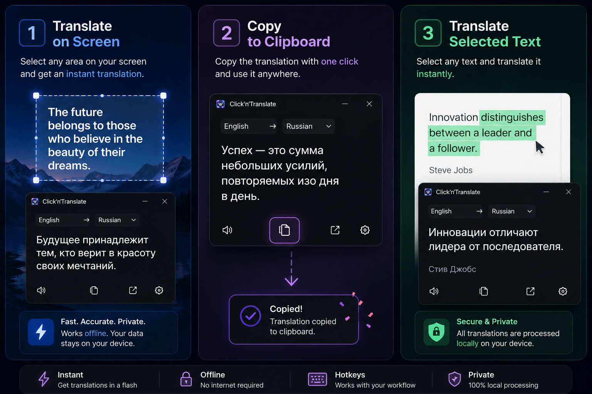
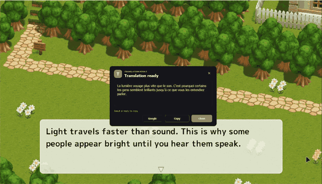
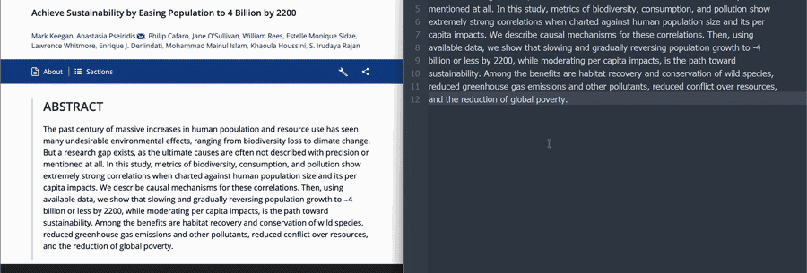
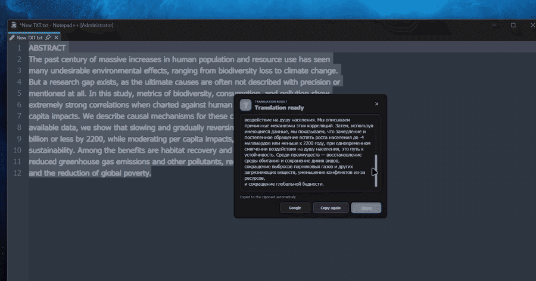
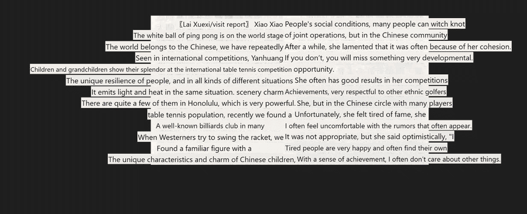
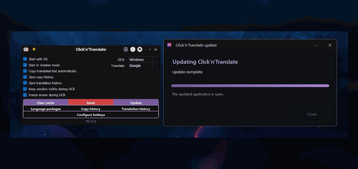

<div align="center">

# Click'n'Translate

### Translate any text on Windows — from games, images, videos, apps, and documents.

**The best all-in-one screen translator for Windows.**<br>
Fast online translation · Private offline engines · Four OCR options · Global hotkeys

[**Download the Windows installer**](https://github.com/jabrailkhalil/clickntranslate/releases/latest/download/Click-n-Translate-1.5.9-windows-x64-installer.exe) · [**Portable ZIP**](https://github.com/jabrailkhalil/clickntranslate/releases/latest/download/Click-n-Translate-1.5.9-windows-portable-x64.zip) · [Release notes](https://github.com/jabrailkhalil/clickntranslate/releases/latest) · [**Telegram**](https://t.me/jabrail_digital)

  

**English** · [Русский](docs/readme/README.ru.md) · [简体中文](docs/readme/README.zh-CN.md) · [Español](docs/readme/README.es.md) · [Français](docs/readme/README.fr.md)

</div>



## See it. Select it. Understand it.

Click'n'Translate turns text anywhere on your Windows screen into something you can copy or understand. Select an area, press a global hotkey, and continue working — without retyping text, opening a browser tab, or breaking your flow.

| When you need to… | Click'n'Translate does it with… | Result |
| --- | --- | --- |
| Copy text that cannot be selected | Area OCR | Clean text in your clipboard |
| Translate part of an app, game, or image | OCR + translation | A focused translation window |
| Understand an entire screen | Full-screen translation | Translated text placed over the original |
| Translate highlighted text instantly | Selection translation | Your saved source and target language pair |
| Translate a document | Drag and drop or `Ctrl + O` | Side-by-side original and translation |

> **One app instead of a collection of utilities:** screen capture, OCR, online translation, offline translation, document translation, histories, language packages, and configurable hotkeys all work together.

## See it in action

### Translate game text



### Copy text from any screen area



### Translate selected text in any application



### Translate the full screen



### Update in one click



## Why Click'n'Translate stands out

| Capability | What you get |
| --- | --- |
| **Instant screen translation** | Capture a region or the whole screen and translate it immediately |
| **Text extraction everywhere** | Copy text from games, video, images, remote desktops, and interfaces that block selection |
| **Online and offline translation** | Choose speed and convenience, or keep translation on your PC |
| **Four OCR engines** | Match the engine to the language, font, image quality, or task |
| **Package manager** | Install and remove OCR languages and offline translation packages inside the app |
| **Document workspace** | Translate `.txt`, `.md`, `.docx`, `.pdf`, `.html`, and `.rtf` files |
| **Six interface languages** | English, Russian, Spanish, German, French, and Chinese |
| **Optional local histories** | Keep copy and translation history only when you want it |

## Choose the right engine for every task

| Layer | Available engines | Connection | Best for |
| --- | --- | --- | --- |
| **Online translation** | Google, MyMemory, Lingva, LibreTranslate | Internet required | Fast everyday translation without model downloads |
| **Offline translation** | Argos Translate, Hy-MT | Offline after installation | Private translation and unreliable connections |
| **OCR** | Windows OCR, Tesseract, RapidOCR, EasyOCR | Local after installation | Different scripts, fonts, layouts, and image quality |

### Online or offline? You decide.

| | Online providers | Offline providers |
| --- | --- | --- |
| Setup | Ready immediately | Install the chosen engine or language package once |
| Speed | Usually the fastest option | Depends on your PC and model |
| Privacy | Selected text is sent to the provider | Text stays on your computer |
| Availability | Requires internet | Works without internet after setup |
| Best choice for | Everyday convenience | Sensitive text, travel, and private workflows |

## Four actions. Zero friction.

| Default hotkey | Action |
| --- | --- |
| `Ctrl + Alt + C` | Extract text from an area and copy it |
| `Ctrl + Alt + T` | Capture an area, recognize the text, and translate it |
| `Ctrl + Alt + F` | Translate the entire screen |
| `Ctrl + Alt + Q` | Translate selected text with the language pair from the main window |

Every shortcut can be changed in **Settings → Configure hotkeys**. Your chosen languages are remembered, including the pair used for selected-text and full-screen translation.

## Language packages without the command line

Open **Settings → Language packages** to manage everything from one place.

| Package area | What you can manage |
| --- | --- |
| Windows OCR | Windows language capabilities and their real installation status |
| Tesseract | Local engine and language data |
| EasyOCR | Neural OCR engine and supported language models |
| RapidOCR | Neural OCR runtime, detector, and recognition models |
| Argos Translate | Offline translation directions installed before translation |
| Hy-MT | Local language model and runtime |

Installed packages are shown first. Downloads display progress, can continue in the background where supported, and removable packages can be deleted from the same window.

## Install your way

| Edition | Choose it when… | How to start |
| --- | --- | --- |
| **Windows installer** | You want the simplest setup, shortcuts, and reliable in-app updates | [Download the installer](https://github.com/jabrailkhalil/clickntranslate/releases/latest/download/Click-n-Translate-1.5.9-windows-x64-installer.exe) and run it |
| **Portable ZIP** | You want a self-contained folder you can move or keep on another drive | [Download the ZIP](https://github.com/jabrailkhalil/clickntranslate/releases/latest/download/Click-n-Translate-1.5.9-windows-portable-x64.zip), extract it, and run `ClicknTranslate.exe` |

### Start translating in under a minute

1. Install or extract Click'n'Translate.
2. Choose the interface language, OCR engine, and translator.
3. Press `Ctrl + Alt + T` and drag over any text on the screen.
4. Add optional offline engines or OCR languages from **Settings → Language packages**.

No account or separate Python installation is required. Click'n'Translate supports Windows 10 and Windows 11 x64. Internet access is needed for online translation and optional package downloads; installed offline engines work without it.

## Made for real Windows workflows

| Use case | Why it helps |
| --- | --- |
| Games and visual novels | Translate dialogue without leaving the game |
| Images and videos | Extract text that was never selectable |
| Work applications | Translate labels, messages, reports, and remote desktops |
| Documents | Open common formats and work with original and translated text side by side |
| Language learning | Compare source and translated text while reading |
| Travel and offline work | Use downloaded OCR and translation packages without a connection |

## Built for daily use

| Experience | Reliability |
| --- | --- |
| Dark and light themes | Dedicated OCR and Argos worker processes |
| System tray and optional Windows startup | Transactional updates with rollback protection |
| Configurable global hotkeys | Automatic restart after a successful update |
| Local copy and translation histories | User data preserved across updates |
| Clear package download progress | Folder-based build for responsive startup |
| Multilingual onboarding and FAQ | Optional engines isolated inside the app folder |

## Privacy without guesswork

| Mode | Where processing happens |
| --- | --- |
| Windows OCR, Tesseract, RapidOCR, EasyOCR | On your computer |
| Argos Translate and Hy-MT | On your computer |
| Google, MyMemory, Lingva, LibreTranslate | Text is sent to the selected online provider |
| Copy and translation histories | Stored locally only when enabled |

Read the full [privacy policy](PRIVACY.md).

## Updating from an older version

Users on **1.5.0 or newer** can update from inside the app. The updater downloads the new installer, shows progress through the complete update, protects the previous installation until replacement succeeds, and reopens Click'n'Translate when finished.

The updater in versions older than 1.5.0 cannot install current releases reliably. If you are upgrading from 1.4.x, close the old app and install the latest version manually once. Future updates can then be installed from the app.

## Frequently asked questions

<details>
<summary><strong>Does Click'n'Translate work offline?</strong></summary>

Yes. Install an OCR engine and either Argos Translate or Hy-MT from **Language packages**. Online providers remain available when you prefer them.

</details>

<details>
<summary><strong>Can it copy text from games, images, and video?</strong></summary>

Yes. OCR works with pixels on the screen, so the source text does not need to be selectable.

</details>

<details>
<summary><strong>Why are OCR and translation packages optional?</strong></summary>

You download only the engines and languages you need. This keeps the main installer smaller and avoids bundling several gigabytes of models for every user.

</details>

<details>
<summary><strong>Is the portable edition really self-contained?</strong></summary>

The application, settings, histories, and optional packages stay with the extracted folder. Windows OCR language capabilities are operating-system components and are managed by Windows.

</details>

<details>
<summary><strong>Which document formats are supported?</strong></summary>

Click'n'Translate can open `.txt`, `.md`, `.docx`, `.pdf`, `.html`, `.htm`, and `.rtf`. Translations can be saved as text, Markdown, or a reopenable local session.

</details>

## Build from source

<details>
<summary>Developer instructions</summary>

```powershell
git clone https://github.com/jabrailkhalil/clickntranslate.git
cd clickntranslate
pip install -r requirements.txt
python main.py

# Build the folder-based Windows distribution
python -m PyInstaller ClicknTranslate.spec --clean --noconfirm
```

The release uses a folder-based PyInstaller build for responsive startup. Optional OCR runtimes and language models are installed separately instead of making every download several gigabytes.

</details>

## Support the project

If Click'n'Translate saves you time:

- ⭐ Star the repository so more Windows users can discover it.
- 🐛 [Report a bug or request a feature](https://github.com/jabrailkhalil/clickntranslate/issues).
- 💬 Follow updates or ask a question on Telegram: [@jabrail_digital](https://t.me/jabrail_digital).

<div align="center">

### Ready to translate anything on your screen?

[**Download Click'n'Translate for Windows**](https://github.com/jabrailkhalil/clickntranslate/releases/latest/download/Click-n-Translate-1.5.9-windows-x64-installer.exe)

</div>
