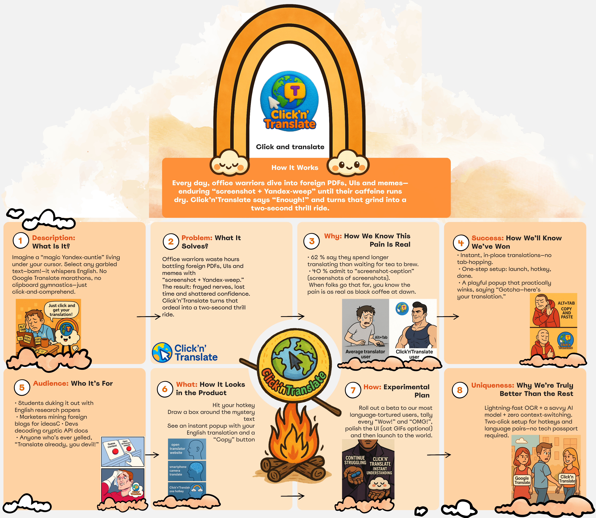

1. Click'n'Translate is a modern application for instant text translation using hotkeys and OCR technology.
2. The project integrates Argos Translate and Windows OCR to handle both selected text and image-based text.
3. Built with PyQt5, its intuitive interface supports multiple languages and customizable themes.
4. Users can configure hotkeys, choose translation modes, and switch between dark and light themes for an optimal experience.
5. This open-source project welcomes contributions, encouraging community involvement to continuously enhance its features.
