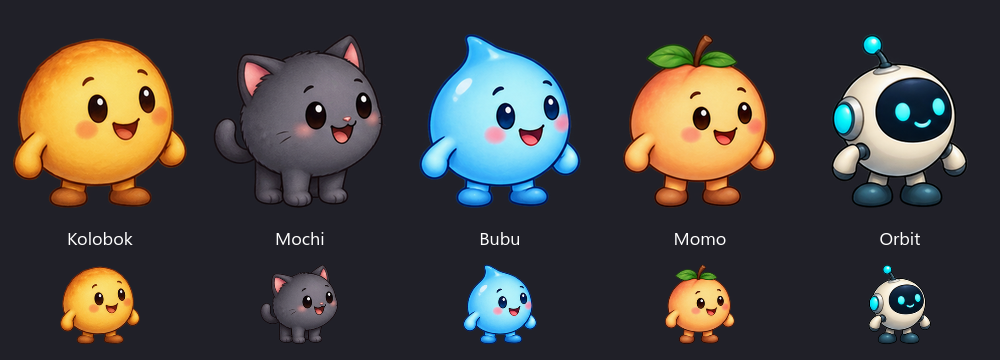
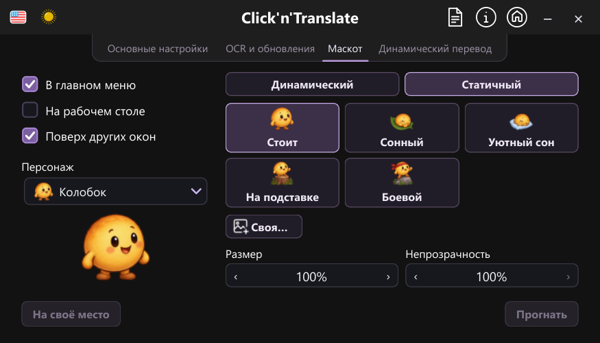

# Локальная версия 1.8.2: новые маскоты

> **Передача 4 октября 2026:** актуальная проба Блинчика — v15 в `preview-pancake-cycle.cmd`. Исходники и материалы сохраняются в ветке `codex/custom-mascots` для продолжения. [Текущее состояние и запуск на другом устройстве](CONTINUE_ON_ANOTHER_DEVICE.md). Сведения о сборке и проверках ниже относятся к прежней редакции.

> **Текущий статус — визуальная доработка из Python.** После замечаний к анимации сборка остановлена. Новые сборки и тесты не запускать до завершения визуальной доработки. Актуальный просмотр: `preview-mascots.cmd` или `.venv\Scripts\python.exe tools/preview_mascots.py`. В текущих исходниках Блинчик заменил Колобка, Бубу ползает без ног и прыжков, у кота новые лапы. Ниже — сведения о прежней локальной редакции, не отчёт о текущей.

Сборка для проверки владельцем проекта. Публикация, тег и отправка в GitHub не выполнялись.

## Изменения

- Пять персонажей: Колобок, Моти, Бубу, Момо и Орбит.
- Выбор через выпадающий список с иконками и крупным предпросмотром.
- У каждого десять кадров прогулки, обычная поза, два варианта сна и две позы на объекте.
- В главном окне и на рабочем столе используется один выбранный герой.
- Пауза, положение, размер и прозрачность сохраняются при смене персонажа.
- Прежние изображения удалены. Удалённый дополнительный значок в старых настройках заменяется обычной позой Колобка.
- Своя картинка по-прежнему доступна.

Исходники созданы встроенным imagegen по пяти концепциям владельца проекта.
[Промпты и исходные атласы](mascots/PROMPTS.md), [сборка ресурсов](../tools/prepare_mascots.py).

## Проверки

- 150 тестов: ресурсы и прозрачность, выбор персонажа и клавиатура, миграция настроек, сохранение паузы и положения, скрытие при захвате, размеры настроек на шести языках при 100/150/200%.
- Ещё 5 тестов анимации в главном окне: общий кэш, отсутствие чтения картинок на каждом кадре, остановка таймера при скрытии, меню и закрытие помощника.
- `python tools/qa_mascots.py`: 20 видов настроек, два листа персонажей и два раскрытых списка в светлой/тёмной теме. Снимки сохраняются в `.tmp/mascot-qa`.
- Полный набор тестов приложения не запускался до конца: два старых теста `test_ui_polish.py`, создающих настоящее главное окно без изоляции приветственного диалога, ожидали его закрытия. Они исключены из отдельного запуска проверок предпросмотра.
- Нативные macOS и Linux в этой работе не проверялись.

## Локальная Windows-сборка

`releases/ClicknTranslate-v1.8.2-local-mascots/ClicknTranslate/ClicknTranslate.exe`

- Python 3.12.10, PyInstaller 6.20.0. Версия всех пяти исполняемых файлов — 1.8.2.0.
- Проверены встроенные архивы трёх Python-программ; версия и список персонажей проверены непосредственно в упакованном коде.
- 31 файл ресурсов маскотов совпадает с исходниками по SHA-256. Старые изображения отсутствуют.
- Проверены контрольные суммы всех 4793 файлов пакета.
- Запуск через лаунчер в режиме `--layout-editor`: приложение дошло до цикла обработки событий и записало подтверждение `1.8.2` после проверки пакета.
- ArgosWorker ответил на `probe` без ошибки; OcrWorker подтвердил импорт RapidOCR. Модели и языковые пакеты для этой проверки не скачивались.
- Computer Use обнаружил окно собранной программы. Нативный снимок окна не получен: `FrameArrived timed out`; внешний вид проверен снимками Qt из изолированного запуска исходников.
- Тестовое окно закрыто, его конфигурация сохранена в `.tmp/package-qa/smoke-config.json`. Установленная версия пользователя не менялась.
- Это локальная сборка без цифровой подписи. Теги, push и публикация релиза не выполнялись.
