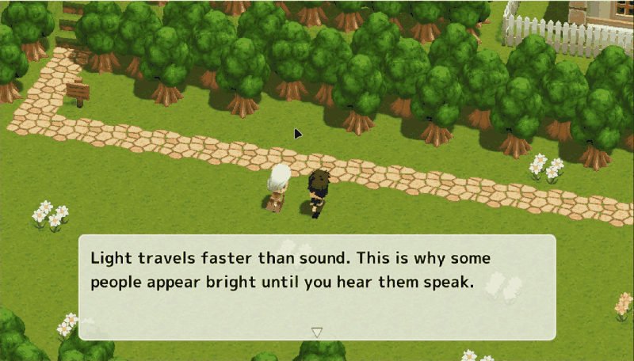

<div align="center">

# Click'n'Translate

### La meilleure application de traduction d'écran et d'OCR pour Windows.

[**Télécharger pour Windows**](https://github.com/jabrailkhalil/clickntranslate/releases/latest/download/Click-n-Translate-1.5.6-windows-x64-installer.exe) · [ZIP portable](https://github.com/jabrailkhalil/clickntranslate/releases/latest/download/Click-n-Translate-1.5.6-windows-portable-x64.zip) · [Dernière version](https://github.com/jabrailkhalil/clickntranslate/releases/latest)

 

[English](../../README.md) · [Русский](README.ru.md) · [简体中文](README.zh-CN.md) · [Español](README.es.md) · **Français**

</div>


Click'n'Translate est la meilleure application tout-en-un de traduction d'écran de sa catégorie. Elle transforme tout texte visible sous Windows en contenu que vous pouvez copier ou traduire. Sélectionnez une zone, utilisez un raccourci global et poursuivez votre travail — sans navigateur, sans saisie manuelle et sans changer de fenêtre.

## Démonstration



## Pourquoi Click'n'Translate est la meilleure ?

- **Traduisez ce que vous voyez.** Capturez une zone ou l'écran entier et obtenez immédiatement la traduction.
- **Copiez le texte impossible à sélectionner.** Extrayez-le d'images, de vidéos, de jeux, de bureaux à distance et d'interfaces protégées.
- **Choisissez entre rapidité et confidentialité.** Utilisez des services en ligne ou conservez le traitement sur votre PC avec Argos et Hy-MT.
- **Choisissez le bon moteur OCR.** Windows OCR, Tesseract, RapidOCR et EasyOCR sont disponibles dans un gestionnaire de paquets unique.
- **Travaillez dans n'importe quelle application.** Quatre raccourcis globaux personnalisables restent toujours disponibles.
- **Gardez le contrôle.** Les historiques de traduction et de copie sont facultatifs et stockés localement.

## Quatre actions, sans friction

| Raccourci par défaut | Action |
| --- | --- |
| `Ctrl + Alt + C` | Extraire le texte d'une zone et le copier |
| `Ctrl + Alt + T` | Capturer une zone, reconnaître le texte et le traduire |
| `Ctrl + Alt + F` | Traduire l'écran entier |
| `Ctrl + Alt + Q` | Traduire une zone sélectionnée de l'écran |

Tous les raccourcis peuvent être modifiés dans **Paramètres → Configurer les raccourcis**.

## Moteurs de traduction et d'OCR

| Type | Moteurs | Idéal pour |
| --- | --- | --- |
| Traduction en ligne | Google, MyMemory, Lingva, LibreTranslate | Traduction rapide sans télécharger de modèle |
| Traduction hors ligne | Argos Translate, Hy-MT | Traduction privée après l'installation des paquets choisis |
| OCR | Windows OCR, Tesseract, RapidOCR, EasyOCR | Extraction de texte pour différents alphabets et types d'images |

Click'n'Translate propose 16 langues sélectionnables pour l'OCR et la traduction. L'interface est disponible en anglais, russe, espagnol, allemand, français et chinois. Le gestionnaire ne télécharge que les langues OCR et les directions de traduction hors ligne que vous choisissez.

Aucun autre outil de ce segment ne réunit un choix aussi complet d'OCR, de traduction en ligne et hors ligne, de raccourcis globaux et de gestion des paquets dans une seule application Windows aussi soignée.

> **Confidentialité :** les moteurs OCR locaux et de traduction hors ligne traitent le texte sur votre ordinateur. Les services en ligne reçoivent le texte que vous leur demandez de traduire.

## Démarrage rapide

1. Téléchargez et lancez le **[programme d'installation Windows](https://github.com/jabrailkhalil/clickntranslate/releases/latest/download/Click-n-Translate-1.5.6-windows-x64-installer.exe)**.
2. Ouvrez Click'n'Translate et choisissez les langues de l'interface, de l'OCR et de traduction.
3. Appuyez sur `Ctrl + Alt + T`, sélectionnez une zone et obtenez la traduction.
4. Pour la traduction hors ligne ou d'autres OCR, ouvrez **Paramètres → Paquets de langues** et installez uniquement ce dont vous avez besoin.

Aucune installation de Python et aucun compte ne sont nécessaires. Windows 10 et Windows 11 64 bits sont pris en charge. Une connexion internet est nécessaire pour la traduction en ligne et le téléchargement des paquets facultatifs ; les moteurs hors ligne installés fonctionnent sans connexion.

### Version portable

Téléchargez le [ZIP portable](https://github.com/jabrailkhalil/clickntranslate/releases/latest/download/Click-n-Translate-1.5.6-windows-portable-x64.zip), extrayez-le dans un dossier permanent et lancez `ClicknTranslate.exe`. Placez le dossier à son emplacement définitif avant d'activer le démarrage automatique ou de créer des raccourcis.

### Mise à jour depuis une ancienne version

Le programme de mise à jour des versions antérieures à 1.5.0 ne peut pas installer la version actuelle de manière fiable. Si vous venez de 1.4.x, fermez l’application et installez manuellement 1.5.6 une seule fois. Les utilisateurs de 1.5.0 ou version ultérieure peuvent passer à 1.5.6 depuis l’application.

## Le meilleur choix au quotidien

- Thèmes sombre et clair
- Zone de notification et démarrage facultatif avec Windows
- Raccourcis globaux personnalisables
- Historiques locaux de copie et de traduction
- Progression des téléchargements et suppression des paquets
- Processus distincts pour l'OCR et Argos afin d'améliorer la stabilité
- Mises à jour préservant les données utilisateur

## Exécuter depuis le code source

```powershell
git clone https://github.com/jabrailkhalil/clickntranslate.git
cd clickntranslate
pip install -r requirements.txt
python main.py

# Construire la distribution Windows en mode dossier
python -m PyInstaller ClicknTranslate.spec --clean --noconfirm
```

La version publiée utilise une construction PyInstaller en mode dossier pour démarrer rapidement. Les moteurs OCR facultatifs et les modèles linguistiques sont installés séparément afin d'éviter des téléchargements de plusieurs gigaoctets.

## Assistance et retours

- [Signaler un problème ou proposer une fonctionnalité](https://github.com/jabrailkhalil/clickntranslate/issues)
- Telegram : [@jabrail_digital](https://t.me/jabrail_digital)

Si le meilleur traducteur d'écran pour Windows vous fait gagner du temps, ajoutez une étoile au dépôt et aidez d'autres utilisateurs à le découvrir.
