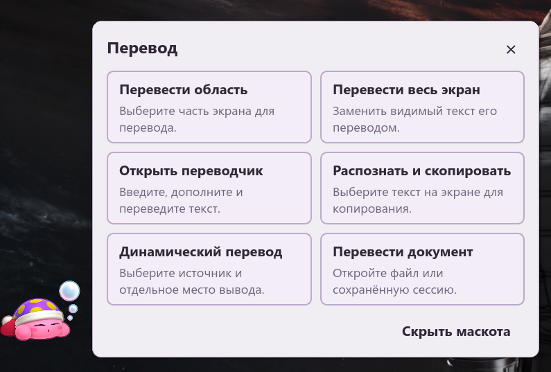
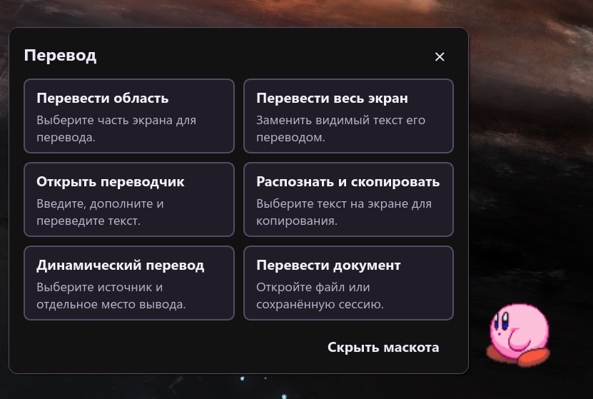
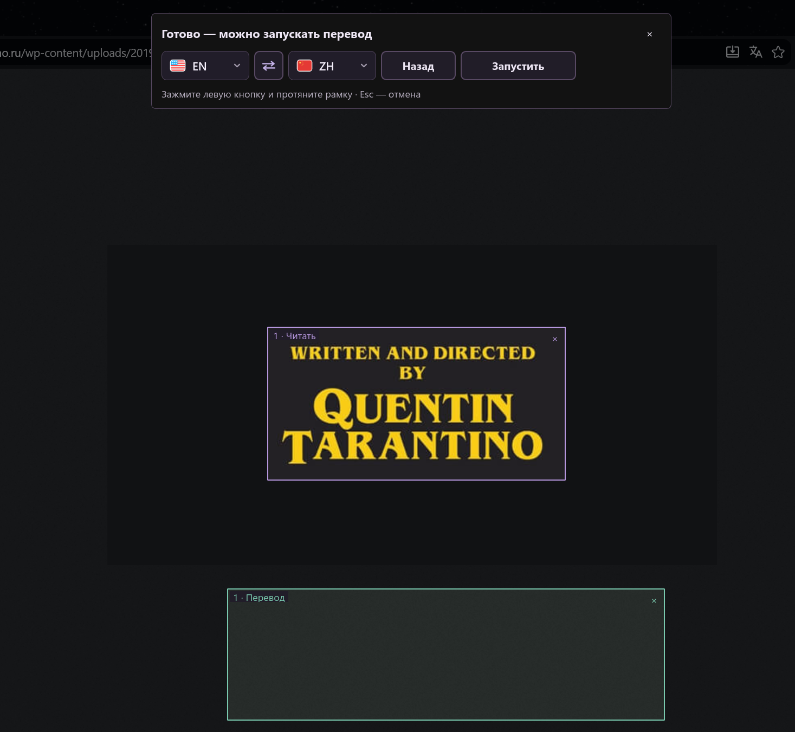

# Click'n'Translate

适用于 **Windows、Linux 和 macOS** 的免费开源屏幕 OCR 与翻译工具。从应用、图片和游戏中提取文字，翻译选中文本，或持续翻译一个或多个屏幕区域。

[English](../../README.md) · [Русский](README.ru.md) · **简体中文** · [Español](README.es.md) · [Français](README.fr.md)

## 下载 1.8.1

| 系统 | 下载 | 用途 |
| --- | --- | --- |
| Windows x64 | [安装程序 (.exe)](https://github.com/jabrailkhalil/clickntranslate/releases/download/v1.8.1/Click-n-Translate-1.8.1-windows-x64-installer.exe) | 在 Windows 10/11 x64 上正常安装。 |
| Windows x64 | [Portable ZIP](https://github.com/jabrailkhalil/clickntranslate/releases/download/v1.8.1/Click-n-Translate-1.8.1-windows-portable-x64.zip) | 无需安装；请完整解压后运行。 |
| Linux x86_64 | [AppImage](https://github.com/jabrailkhalil/clickntranslate/releases/download/v1.8.1/Click-n-Translate-1.8.1-linux-x86_64.AppImage) | Linux x86_64 单文件应用；启动前请赋予执行权限。 |
| Mac — Apple Silicon | [DMG (M1+)](https://github.com/jabrailkhalil/clickntranslate/releases/download/v1.8.1/Click-n-Translate-1.8.1-macos-arm64.dmg) | 适用于 Apple Silicon（M1 及更新芯片），要求 macOS 13.4 或更新版本。 |
| Mac — Intel | [DMG (Intel)](https://github.com/jabrailkhalil/clickntranslate/releases/download/v1.8.1/Click-n-Translate-1.8.1-macos-x86_64.dmg) | 适用于 Intel Mac（x86_64），要求 macOS 13.4 或更新版本。 |

[全部下载、SHA-256 校验和及签名文件](https://github.com/jabrailkhalil/clickntranslate/releases/tag/v1.8.1).

Windows 和 macOS 版本目前使用名为 **`jabrailkhalil` 的自签名证书**。Windows 可能显示 SmartScreen 警告；Mac 版本尚无 Apple Developer ID 签名或公证，Gatekeeper 可能阻止首次启动。Linux 下载提供独立的 OpenPGP 签名。M1 及更新芯片请选择 **Apple Silicon**，Intel 处理器的 Mac 请选择 **Intel**。

**首次启动：**[Windows：SmartScreen 与 Defender](../guides/setup.zh-CN.md#windows) · [Mac：允许启动及屏幕权限](../guides/setup.zh-CN.md#macos)。

**更新：**Windows 可在应用内更新。macOS 和 Linux 需下载新的 DMG/AppImage 并手动替换应用，请保留现有用户数据。

## 功能

- 屏幕 OCR、选中文本翻译、全屏叠加和多区域动态翻译。
- 在线翻译与本地 OCR；下载语言模型后可使用离线翻译。
- 文档翻译、可配置快捷键和桌面助手。
- 明暗主题、六种界面语言，以及每种模式独立的窗口偏好设置。
- **1.8.0：**统一欢迎界面、改进语言菜单和动态叠加、macOS 权限引导，以及全应用细滚动条。

文档工作区支持 `.txt`、`.md`、`.docx`、`.pdf`、`.html`、`.htm` 和 `.rtf`。可以并排编辑原文与译文，也可以隐藏原文以缩小窗口。设置中提供偏好导入/导出，以及可选的本地历史记录。

## 实际演示

### 翻译游戏文字

### 复制任意屏幕区域的文字

### 翻译应用中选中的文字

### 翻译整个屏幕

### 一键更新（Windows）

## 桌面吉祥物助手

不想记快捷键？点击吉祥物即可打开操作菜单：翻译选定区域或全屏、识别并复制文字、打开翻译器、启动动态翻译或翻译文档。不需要时可以隐藏助手。

| 浅色主题 | 深色主题 |
| --- | --- |
|  |  |

## 动态翻译

选择一个或多个屏幕区域以及翻译语言。识别区域内的文字变化时，翻译会随之更新。译文可以覆盖原文，也可以显示在单独的区域中。

设置示例：紫色边框为识别区域，绿色边框为单独的译文显示区域。

## 快捷键

| 默认快捷键 | 操作 |
| --- | --- |
| `Ctrl + Alt + C` | 识别选定区域中的文字并复制 |
| `Ctrl + Alt + T` | 捕获区域、识别文字并翻译 |
| `Ctrl + Alt + F` | 翻译整个屏幕 |
| `Ctrl + Alt + Q` | 翻译当前应用中选中的文字 |
| `Ctrl + Shift + Q` | 用译文替换选中的文字 |
| `Ctrl + Shift + Space` | 显示或隐藏 Click'n'Translate |
| `Ctrl + Alt + G` | 启动或停止所选区域的动态翻译 |

所有快捷键均可在 **设置 → 配置快捷键** 中修改或清除。OCR、选中文字、替换、全屏和动态翻译会分别记住所选语言对。

表中列出 Windows 默认快捷键。在 **macOS** 上，用 **Command** 替代 Ctrl，用 **Option** 替代 Alt。在 **Linux** 上，请在桌面快捷键设置中绑定对应命令：[Linux 指南](../LINUX.md)。

## 翻译与 OCR 引擎

| 类型 | 引擎 | 适用场景 |
| --- | --- | --- |
| 在线翻译 | Google、MyMemory、Lingva、LibreTranslate | 无需下载模型的快速翻译 |
| 离线翻译 | Argos Translate、Hy-MT | 安装所选软件包后的本地私密翻译 |
| OCR | Windows OCR / Apple Vision、Tesseract、RapidOCR、EasyOCR | 识别不同文字系统和图像样式 |

在**设置 → 语言包**中安装或删除 OCR 引擎、识别语言和离线翻译模型。仅下载您选择的软件包；已安装的离线引擎无需联网。原生 OCR 在 Windows 上使用 Windows OCR，在 macOS 上使用 Apple Vision。在线翻译服务的可用性取决于服务商。

## 开始使用

1. 下载适合您系统的文件并打开应用。发行包已包含 Python 运行环境。
2. 在设置中选择 OCR 引擎、翻译服务及语言。离线翻译需先下载语言模型。
3. 选择捕获或翻译操作。在 Mac 上按照提示授予**屏幕录制**和**辅助功能**权限。Linux 桌面快捷键设置请参阅 [Linux 指南](../LINUX.md)。

OCR 在本地运行。在线翻译会将文本发送给您选择的服务；如需本地翻译，请使用离线引擎。参阅[隐私说明](../../PRIVACY.md)。

## 帮助与开发

[Linux 指南](../LINUX.md) · [macOS 指南与构建](../MACOS.md) · [反馈问题](https://github.com/jabrailkhalil/clickntranslate/issues) · [GPL-3.0 许可证](../../LICENSE)

如需诊断报告，请在应用中打开**帮助 → 错误报告**，并将生成的 ZIP 附在反馈中。报告不包含剪贴板文本、文档内容、历史记录或凭据。

Click’n’Translate 完全免费。如果对您有帮助，欢迎[在 GitHub 上为项目加星](https://github.com/jabrailkhalil/clickntranslate)，并[加入 Telegram](https://t.me/jabrail_digital)。
